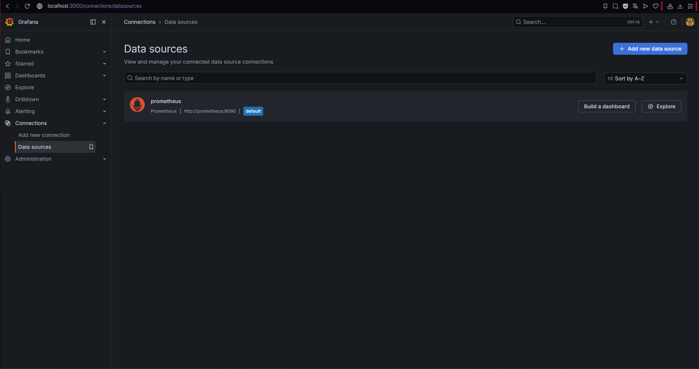
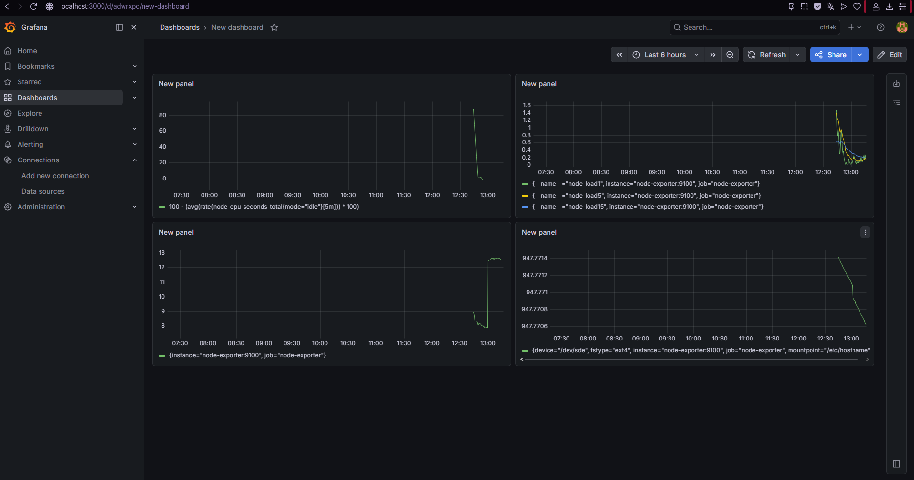
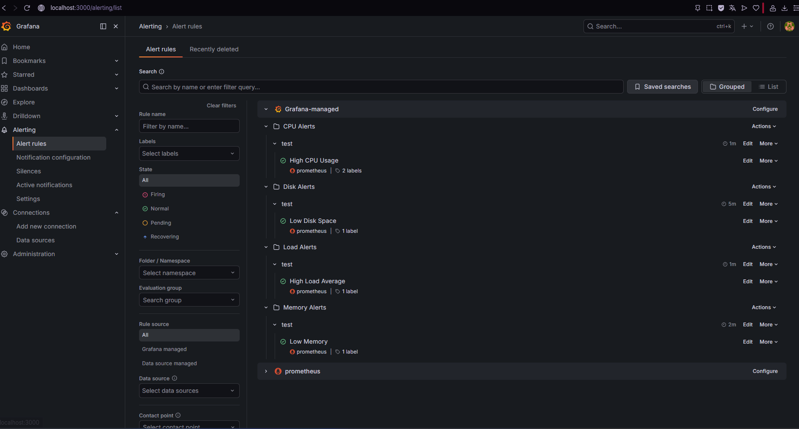

###Задание 1



###Задание 2

100 - (avg(rate(node_cpu_seconds_total{mode="idle"}\[5m])) \* 100) - утилизация CPU для nodeexporter (в процентах, 100-idle);
node_load1 node_load5 node_load15 - CPULA 1/5/15;
node_memory_MemFree_bytes / 1024 / 1024 / 1024 - количество свободной оперативной памяти;
node_filesystem_avail_bytes{mountpoint="/etc/hostname"} / 1024 / 1024 / 1024 - количество места на файловой системе.



###Задание 3



###Задание 4

```json

{

 "apiVersion": "dashboard.grafana.app
 "kind": "Dashbo
 "metadat
   "name": "adwr
   "namespace": "defa
   "uid": "a801ad18-433e-49ad-a13a-8de3e6184
   "resourceVersion": "1777371387583
   "generation
   "creationTimestamp": "2026-04-28T10:16:
   "label
     "grafana.app/deprecatedInternalID": "443625785358

   "annotation
     "grafana.app/createdBy": "user:cfkfvvjei4l
     "grafana.app/folder"
     "grafana.app/saved-from-ui": "Grafana v13.0.1 (a1000


 "spe
   "annotations

       "kind": "AnnotationQu
       "spe
         "quer
           "kind": "DataQu
           "group": "graf
           "version":
           "datasourc
             "name": "-- Grafan

           "spec

         "enable":
         "hide":
         "iconColor": "rgba(0, 211, 255,
         "name": "Annotations \& Ale
         "builtIn":


   "cursorSync": "
   "description": "t
   "editable":
   "element
     "panel-
       "kind": "Pa
       "spe
         "id
         "title": "New pa
         "description"
         "links":
         "dat
           "kind": "QueryGr
           "spe
             "queries

                 "kind": "PanelQu
                 "spe
                   "quer
                     "kind": "DataQu
                     "group": "prometh
                     "version":
                     "datasourc
                       "name": "afkfvzcf24

                     "spe
                       "editorMode": "c
                       "expr": "100 - (avg(rate(node\_cpu\_seconds\_total{mode=\\"idle\\"}\[5m])) \* 1
                       "legendFormat": "\_\_a
                       "range":


                   "refId":
                   "hidden":


             "transformations":
             "queryOptions


         "vizConfi
           "kind": "VizCon
           "group": "timeser
           "version": "13.
           "spe
             "option
               "annotation
                 "clustering"
                 "multiLane":

               "legen
                 "calcs":
                 "displayMode": "l
                 "placement": "bot
                 "showLegend":

               "toolti
                 "hideZeros": f
                 "mode": "sin
                 "sort": "


             "fieldConfi
               "default
                 "threshold
                   "mode": "absol
                   "steps

                       "value
                       "color": "g


                       "value"
                       "color":


                 "colo
                   "mode": "palette-cla

                 "custo
                   "axisBorderShow": f
                   "axisCenteredZero": f
                   "axisColorMode": "t
                   "axisLabel"
                   "axisPlacement": "a
                   "barAlignment
                   "barWidthFactor":
                   "drawStyle": "l
                   "fillOpacity
                   "gradientMode": "n
                   "hideFro
                     "legend": f
                     "tooltip": f
                     "viz":

                   "insertNulls": f
                   "lineInterpolation": "lin
                   "lineWidth
                   "pointSize
                   "scaleDistributio
                     "type": "li

                   "showPoints": "a
                   "showValues": f
                   "spanNulls": f
                   "stackin
                     "group":
                     "mode": "

                   "thresholdsStyl
                     "mode":


               "overrides"


     "panel-
       "kind": "Pa
       "spe
         "id
         "title": "New pa
         "description"
         "links":
         "dat
           "kind": "QueryGr
           "spe
             "queries

                 "kind": "PanelQu
                 "spe
                   "quer
                     "kind": "DataQu
                     "group": "prometh
                     "version":
                     "datasourc
                       "name": "afkfvzcf24

                     "spe
                       "editorMode": "buil
                       "expr": "node\_lo
                       "legendFormat": "\_\_a
                       "range":


                   "refId":
                   "hidden":


                 "kind": "PanelQu
                 "spe
                   "quer
                     "kind": "DataQu
                     "group": "prometh
                     "version":
                     "datasourc
                       "name": "afkfvzcf24

                     "spe
                       "editorMode": "buil
                       "expr": "node\_lo
                       "instant": f
                       "legendFormat": "\_\_a
                       "range":


                   "refId":
                   "hidden":


                 "kind": "PanelQu
                 "spe
                   "quer
                     "kind": "DataQu
                     "group": "prometh
                     "version":
                     "datasourc
                       "name": "afkfvzcf24

                     "spe
                       "editorMode": "buil
                       "expr": "node\_loa
                       "instant": f
                       "legendFormat": "\_\_a
                       "range":


                   "refId":
                   "hidden":


             "transformations":
             "queryOptions


         "vizConfi
           "kind": "VizCon
           "group": "timeser
           "version": "13.
           "spe
             "option
               "annotation
                 "clustering"
                 "multiLane":

               "legen
                 "calcs":
                 "displayMode": "l
                 "placement": "bot
                 "showLegend":

               "toolti
                 "hideZeros": f
                 "mode": "sin
                 "sort": "


             "fieldConfi
               "default
                 "threshold
                   "mode": "absol
                   "steps

                       "value
                       "color": "g


                       "value"
                       "color":


                 "colo
                   "mode": "palette-cla

                 "custo
                   "axisBorderShow": f
                   "axisCenteredZero": f
                   "axisColorMode": "t
                   "axisLabel"
                   "axisPlacement": "a
                   "barAlignment
                   "barWidthFactor":
                   "drawStyle": "l
                   "fillOpacity
                   "gradientMode": "n
                   "hideFro
                     "legend": f
                     "tooltip": f
                     "viz":

                   "insertNulls": f
                   "lineInterpolation": "lin
                   "lineWidth
                   "pointSize
                   "scaleDistributio
                     "type": "li

                   "showPoints": "a
                   "showValues": f
                   "spanNulls": f
                   "stackin
                     "group":
                     "mode": "

                   "thresholdsStyl
                     "mode":


               "overrides"


     "panel-
       "kind": "Pa
       "spe
         "id
         "title": "New pa
         "description"
         "links":
         "dat
           "kind": "QueryGr
           "spe
             "queries

                 "kind": "PanelQu
                 "spe
                   "quer
                     "kind": "DataQu
                     "group": "prometh
                     "version":
                     "datasourc
                       "name": "afkfvzcf24

                     "spe
                       "editorMode": "c
                       "expr": "node\_memory\_MemFree\_bytes / 1024 / 1024 / 1
                       "legendFormat": "\_\_a
                       "range":


                   "refId":
                   "hidden":


             "transformations":
             "queryOptions


         "vizConfi
           "kind": "VizCon
           "group": "timeser
           "version": "13.
           "spe
             "option
               "annotation
                 "clustering"
                 "multiLane":

               "legen
                 "calcs":
                 "displayMode": "l
                 "placement": "bot
                 "showLegend":

               "toolti
                 "hideZeros": f
                 "mode": "sin
                 "sort": "


             "fieldConfi
               "default
                 "threshold
                   "mode": "absol
                   "steps

                       "value
                       "color": "g


                       "value"
                       "color":


                 "colo
                   "mode": "palette-cla

                 "custo
                   "axisBorderShow": f
                   "axisCenteredZero": f
                   "axisColorMode": "t
                   "axisLabel"
                   "axisPlacement": "a
                   "barAlignment
                   "barWidthFactor":
                   "drawStyle": "l
                   "fillOpacity
                   "gradientMode": "n
                   "hideFro
                     "legend": f
                     "tooltip": f
                     "viz":

                   "insertNulls": f
                   "lineInterpolation": "lin
                   "lineWidth
                   "pointSize
                   "scaleDistributio
                     "type": "li

                   "showPoints": "a
                   "showValues": f
                   "spanNulls": f
                   "stackin
                     "group":
                     "mode": "

                   "thresholdsStyl
                     "mode":


               "overrides"


     "panel-
       "kind": "Pa
       "spe
         "id
         "title": "New pa
         "description"
         "links":
         "dat
           "kind": "QueryGr
           "spe
             "queries

                 "kind": "PanelQu
                 "spe
                   "quer
                     "kind": "DataQu
                     "group": "prometh
                     "version":
                     "datasourc
                       "name": "afkfvzcf24

                     "spe
                       "editorMode": "c
                       "expr": "node\_filesystem\_avail\_bytes{mountpoint=\\"/etc/hostname\\"} / 1024 / 1024 / 1
                       "legendFormat"
                       "range":


                   "refId":
                   "hidden":


             "transformations":
             "queryOptions


         "vizConfi
           "kind": "VizCon
           "group": "timeser
           "version": "13.
           "spe
             "option
               "annotation
                 "clustering"
                 "multiLane":

               "legen
                 "calcs":
                 "displayMode": "l
                 "placement": "bot
                 "showLegend":

               "toolti
                 "hideZeros": f
                 "mode": "sin
                 "sort": "


             "fieldConfi
               "default
                 "threshold
                   "mode": "absol
                   "steps

                       "value
                       "color": "g


                       "value"
                       "color":


                 "colo
                   "mode": "palette-cla

                 "custo
                   "axisBorderShow": f
                   "axisCenteredZero": f
                   "axisColorMode": "t
                   "axisLabel"
                   "axisPlacement": "a
                   "barAlignment
                   "barWidthFactor":
                   "drawStyle": "l
                   "fillOpacity
                   "gradientMode": "n
                   "hideFro
                     "legend": f
                     "tooltip": f
                     "viz":

                   "insertNulls": f
                   "lineInterpolation": "lin
                   "lineWidth
                   "pointSize
                   "scaleDistributio
                     "type": "li

                   "showPoints": "a
                   "showValues": f
                   "spanNulls": f
                   "stackin
                     "group":
                     "mode": "

                   "thresholdsStyl
                     "mode":


               "overrides"


   "layou
     "kind": "GridLay
     "spe
       "items

           "kind": "GridLayoutI
           "spe
             "x
             "y
             "width"
             "height
             "elemen
               "kind": "ElementRefere
               "name": "pan


           "kind": "GridLayoutI
           "spe
             "x"
             "y
             "width"
             "height
             "elemen
               "kind": "ElementRefere
               "name": "pan


           "kind": "GridLayoutI
           "spe
             "x
             "y
             "width"
             "height
             "elemen
               "kind": "ElementRefere
               "name": "pan


           "kind": "GridLayoutI
           "spe
             "x"
             "y
             "width"
             "height
             "elemen
               "kind": "ElementRefere
               "name": "pan


   "links":
   "liveNow": f
   "preload": f
   "tags":
   "timeSetting
     "timezone": "brow
     "from": "now
     "to": "
     "autoRefresh"
     "autoRefreshIntervals

       "
       "


       "
       "


     "hideTimepicker": f
     "fiscalYearStartMont

   "title": "New dashbo
   "variables":
   "preference
     "layou
       "kind": "GridLay
       "spe
         "items"


 }

}
```
